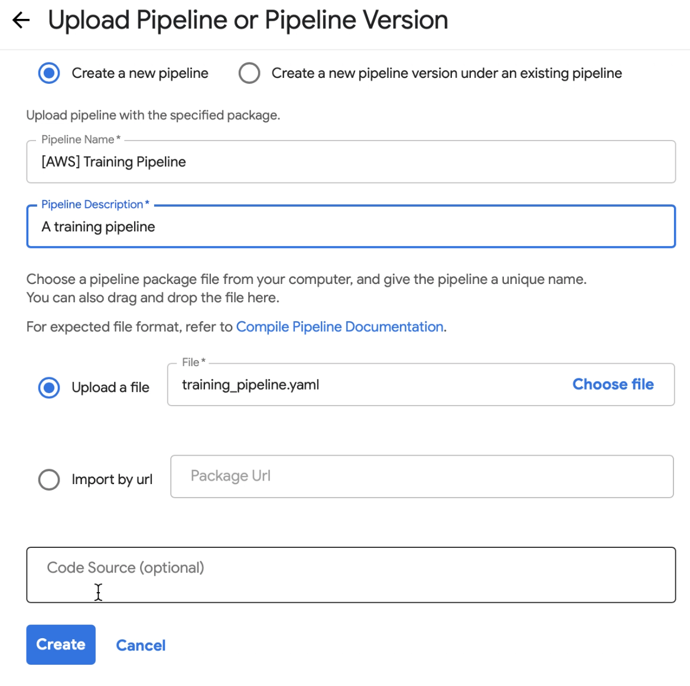
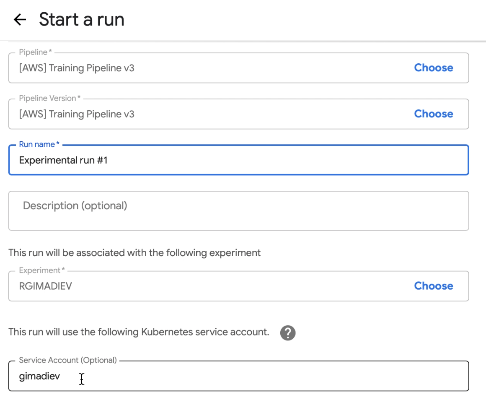

# Quickstart: Deploy Kubeflow on AWS EKS with Terraform

[]( https://sak-kubeflow.slack.com)

<!-- Swiss-Army-Kube-Kubeflow_README -->
**[README](./README.md)** • **[Swiss Army Kube (umbrella repository)](https://github.com/provectus/swiss-army-kube)** • **[Provectus](https://provectus.com/)**

## Overview

This repository is a template of a Kubeflow EKS cluster for your ML projects. Modify the `main.tf` file to set up a cluster, deploy it to AWS with Terraform commands and manage with ArgoCD UI/CLI (or `kubectl`) and Terraform. This simple yet powerful workflow allows you to quickly configure, provision, and replicate multiple dedicated ML-ready Kubeflow Kubernetes clusters (with different settings of variables, networks, Kubernetes versions, etc.).

## Quickstart Contents

1. [Prerequisites](#prereqs)
    + [AWS Account and IAM user](#awsacc)
    + [AWS CLI](#awscli) 
    + [Terraform ](#terraform) 
2. [Cluster Configuration](#clusterconfig)
3. [Cluster Deployment](#clusterserve)
4. [Cluster Access and Management](#clusteraccess)
4. [Kubeflow: Example Use Case](#case)

<br>

<a name="prereqs"></a>
## 1. Install Prerequisites

First, fork and clone this repository. Next, create/install the following prerequisites. 

<a name="awsacc"></a>
### Create an AWS Account and IAM User

- If you don't have an AWS account and IAM user yet, please use this [official guide](https://docs.aws.amazon.com/polly/latest/dg/setting-up.html).

<a name="awscli"></a>
### Install AWS CLI

- Install AWS CLI using this [official guide](https://docs.aws.amazon.com/cli/latest/userguide/cli-chap-install.html). 

<a name="terraform"></a>
### Install Terrafrom

- Install Terraform using this [official guide](https://learn.hashicorp.com/tutorials/terraform/install-cli).

<br>

<a name="clusterconfig"></a>
## 2. Configure Your Cluster 

To set up your cluster, modify the following configuration files as you need: 

- `backend.hcl`
- `main.tf`

### Configure `backend.hcl`

`backend.hcl` is a backend configuration file that stores the Terraform state. 

Example configuration of `backend.hcl`: 

``` hcl
bucket         = "bucket-with-terraform-states"
key            = "some-key/kubeflow-sandbox"
region         = "region-where-bucket-placed"
dynamodb_table = "dynamodb-table-for-locks"
```

### Configure `main.tf`
The minimal required set of variables you need to configure for your Kubeflow EKS cluster is the following: 

- `cluster_name`

- `mainzoneid`

- `domains`

- `admin_arns`

- `cert_manager_email`

- `cognito_users`


Exaple configuration of `main.tf`: 

``` hcl
terraform {
  backend s3 {}
}

module "sak_kubeflow" {
  source = "git::https://github.com/provectus/sak-kubeflow.git?ref=init"

  cluster_name = "simple"

  owner      = "github-repo-owner"
  repository = "github-repo-name"
  branch     = "branch-name"

  #Main route53 zone id if exist (Change It)
  mainzoneid = "id-of-route53-zone"

  # Name of domains aimed for endpoints
  domains = ["sandbox.some.domain.local"]

  # ARNs of users who will have admin permissions.
  admin_arns = [
    {
      userarn  = "arn:aws:iam::<aws-account-id>:user/<username>"
      username = "<username>"
      groups   = ["system:masters"]
    }
  ]

  # Email that would be used for LetsEncrypt notifications
  cert_manager_email = "info@some.domain.local"

  # An optional list of users for Cognito Pool
  cognito_users = [
    {
      email    = "qa@some.domain.local"
      username = "qa"
      group    = "masters"
    },
    {
      email    = "developer@some.domain.local"
      username = "developer"
    }
  ]

  argo_path_prefix = "examples/simple/"
  argo_apps_dir    = "argocd-applications"
}
```

In most cases, you'll need to override variables related to the GitHub repository (`repository`, `branch`, `owner`) in the `main.tf`. 

<br>

<a name="clusterserve"></a>
## 3. Deploy Your Cluster to AWS 

Deploy your configured cluster with the following terraform commands: 

``` bash
terraform init 
terraform apply
aws --region <region> eks update-kubeconfig --name <cluster-name>
```

What these commands do: 
- Initialize Terraform and download all remote dependencies 
- Create a cluster and a clean EKS with all required AWS resources (IAM roles, ASGs, S3 buckets, etc.) 
- Update your local `kubeconfig` file to access your newly created EKS cluster in the configured context 
 

After that, you can manage your Kubernetes cluster with either ArgoCD CLI/UI or `kubectl`. 

To use `kubectl` (Kubernetes CLI for cluster management), install and configure it using this [official guide](https://kubernetes.io/docs/tasks/tools/install-kubectl/).

<br>

<a name="clusteraccess"></a>
## 4. Cluster Access and Management 

### Prepare to start using your cluster

Terraform commands will generate a few files in the default `apps` folder of the repository. You need to commit them in Git and push them to your Github repository to start deploying services to your EKS Kubernetes cluster. 

Note that ArgoCD is pre-configured to track changes of the current repository. When new changes come to the `apps` folder, it triggers the synchronization process and all objects placed in that folder get created.

### Access Kubeflow and ArgoCD UI

Now you have your cluster deployed and ready for work. During the deployment process, two service access endpoints were created in accordance with your `domains` variable settings in the `main.tf` file:

- Kubeflow `https://kubeflow.some.domain.local`
- ArgoCD   `https://argocd.some.domain.local`

To access these URLs, check the email you provided in the `domains` variable for access credentials and use them to log in. Check out this video to see the process of logging into the Kubeflow UI after cluster deployment (Vimeo):
- [Access Kubeflow UI after Cluster Deployment](https://vimeo.com/491622856)


To learn more about Kubeflow and ArgoCD, you can check out their respective official documentation: 
- [Kubeflow](https://www.kubeflow.org/docs/pipelines/pipelines-quickstart/)
- [ArgoCD](https://argoproj.github.io/argo-cd/)

<br>

<a name="case"></a>

## Kubeflow: Example Use Case

Once you have successfully logged into your Amazon EKS cluster via `kubectl`, access Kubeflow UI, pass all the configuration screens, and you’ll see the Kubeflow dashboard: 

<p align="center">
&nbsp;
</p>


To access Kubeflow Pipelines in the UI, click Pipelines. Kubeflow offers a few samples to let you try pipelines quickly. To learn about using Kubeflow on AWS, please check the [official Kubeflow documentation](https://www.kubeflow.org/docs/aws/). 

Alternatively, you can upload your own pipelines using advanced features of AWS and Kubeflow. For instance, let's upload the `kmeans_mnist` [demo module](https://github.com/kubeflow/pipelines/tree/master/samples/contrib/aws-samples/simple_train_pipeline) from the Kubeflow repository with one of the built-in AWS SageMaker algorithms - `kmeans-mnist-pipeline`. 

1. Create a folder for managing separate Terraform states (with resources related to pipeline executions) and add a `main.tf` file with this code:

``` hcl
module kmeans_mnist {
  source = "path/to/kmeans-mnist-pipeline/folder/at/root/of/the/project"

  cluster_name = "<your-cluster-name>"
  username     = "<your-kubeflow-username>"
}
```

2. Run Terraform:

``` bash
terraform init
terraform apply
```

Terraform will generate a `training_pipeline.yaml` file and create a Kubernetes service account that matches your Kubeflow username and has all the required permissions for AWS for running the pipeline. 

The next two steps show how to start using Kubeflow by uploading and running the pipeline. You can check out this video (Vimeo) to see the process (how to upload a pipeline via Kubeflow interface, create an experiment, and start a run): 
- [Start Using Kubeflow on Amazon EKS](https://vimeo.com/491627420)


3. Upload the training pipeline to Kubflow through the Pipelines section of Kubeflow UI:

<p align="center">
&nbsp;
</p>

4. Now that you have your first pipeline and a prepared Kubernetes service account, specify them in the form to start a run:

<p align="center">
&nbsp;
</p>

That's it! Now you have a pipeline executing in Kubeflow.

Any questions? Ask us on Slack: 


[]( https://sak-kubeflow.slack.com)

<a href="#top">Back to top</a>
