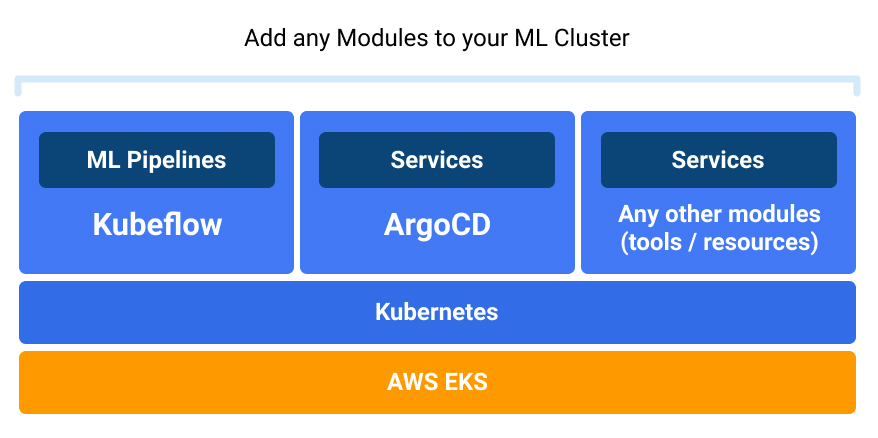
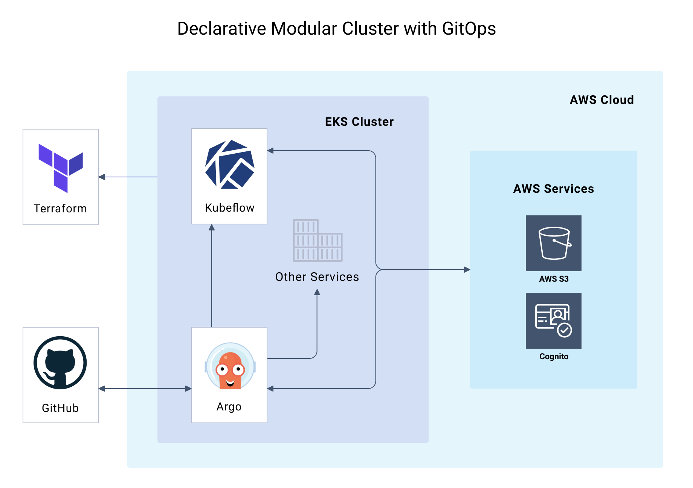

[]()
[](https://www.apache.org/licenses/LICENSE-2.0)
[](https://sak-kubeflow.slack.com)

<!-- Swiss-Army-Kube_README -->
**[Quickstart](./QUICKSTART.md)** • **[Provectus](https://provectus.com/)**

# Deploy Kubeflow on AWS EKS with Swiss Army Kube using Terraform

Existing ways of deploying an Amazon EKS cluster with Kubeflow inside don’t offer a clear blueprint to set up, serve, update, and scale multiple clusters quickly. They require using several CLIs (`kubectl`, `kfctl`, ect.), limit what resources you can add to your cluster after deployment, and don’t allow for CI/CD automation or easy replication of cluster configurations you create.

**Swiss Army Kube for Kubeflow (SAKK)** is a free open-source Terraform-based IaC tool that allows you to declaratively set up modular ML-ready AWS EKS clusters with Kubeflow,  automated with GitOps. SAKK provides a blueprint based on the best DevOps practices, which allows for one-click cluster replication, easy management, and augmenting your clusters with any resources, not limited to native tools. SAKK helps to quickly bring ML-ready clusters to production, and scale them by adding new modules as you go.  SAKK is built on top of Terraform (infrastructure as code), ArgoCD (deployment automation & management of all Kubernetes resources), and Cognito (AWS identity provider). As a result of deployment with SAKK, you get a scalable modular cluster like this:


<p align="center">
&nbsp;
</p>
    
:point_right: **[QUICKSTART](./QUICKSTART.md)**

We believe that any organization or engineer using ML should be able to focus on their pipelines and applications without having to worry too much about the nitty-gritty of infrastructure deployment. Currently, SAKK is available for the [Amazon EKS](https://aws.amazon.com/eks/) (Elastic Kubernetes Service) cluster only. We plan to expand to other platforms soon.

Swiss Army Kube for Kubeflow is based on the main [**Swiss Army Kube**](https://github.com/provectus/swiss-army-kube) repository. SAKK is a SAK modification for the Kubeflow EKS setup based on SAK's collection of modules.

<br>

## Key Features

### Deploy

* Provision an AWS EKS cluster with Kubeflow inside in minutes
* Use existing project structure to set up your ML cluster configuration
* Configure your deployment with a single `.tf` file
* Deploy with a couple of Terraform commands

### Manage

* Add any resources to your cluster before or after deployment
* Deliver your projects and apps with GitOps CI/CD automation
* Easily edit, reconfigure, rerun, add or destroy resources  
* Build your own ML training pipelines in Kubeflow on AWS EKS
* Manage your cluster with Terraform and Kubernetes CLI or ArgoCD CLI/UI

### Scale

* Replicate your cluster configuration with a couple of clicks   
* Configure and deploy as many ML clusters as you need fast 
* Scale deployments by adding new resources as modules
* Reduce your cloud infrastructure spend with spot instances 
* Maximize your workload cost-efficiency 

<br>

## How it Works

This repository is a template of a Kubeflow EKS cluster for your ML projects. Modify the `main.tf` file to set up a cluster and deploy it to AWS with Terraform commands. With this simple yet powerful workflow, you can provision as many ML-ready EKS clusters (with different settings of variables, networks, Kubernetes versions, etc.) as you want in no time.

1. Prerequisites
   + Prepare an AWS account with configured IAM user
   + Fork and clone this repository
   + Install Terraform
   + Install AWS CLI
2. Configure your EKS cluster before deployment using the repo as a template
   + Configure `backend.hcl` 
   + Configure variables in `main.tf` 
3. Deploy your Kubeflow Kubernetes EKS cluster with Terraform commands
4. Commit and push the repository
5. Manage your Kubernetes cluster with ArgoCD (or configure `kubectl`) and deploy your ML apps to it.  

<br>


<br>

## Who is SAKK For

SAKK is great for enterprises that work on ML/AI projects and want to deploy and manage Kubeflow clusters on AWS EKS in a declarative, modular, repeatable, GitOps way.

## Get Started

Please visit our [Quickstart](./QUICKSTART.md) to get ready with prerequisites, configure your cluster, and deploy it with Terraform commands:

``` 
terraform init 
terraform apply
aws --region <region> eks update-kubeconfig --name <cluster-name>
```  
After the deployment, you'll have a Kubernetes cluster with Kubeflow and ArgoCD inside, deployed on AWS EKS and automated with GitOps (as shown below). You can manage your Kubernetes cluster with `kubectl` CLI or ArgoCD CLI/UI, and your AWS cluster with AWS or Terraform CLI. 

<p align="center">
&nbsp;
</p>

<br>

## How to Contribute

To get involved, please check out our [CONTRIBUTING.md](./CONTRIBUTING.md).

## License

[Apache 2.0 License](https://www.apache.org/licenses/LICENSE-2.0.txt).

<br>

## We Love Your Feedback!

We are always happy to hear your thoughts and questions about SAKK. Please join our Slack to discuss:
[](https://sak-kubeflow.slack.com) 

<a href="#top">Back to top</a>
